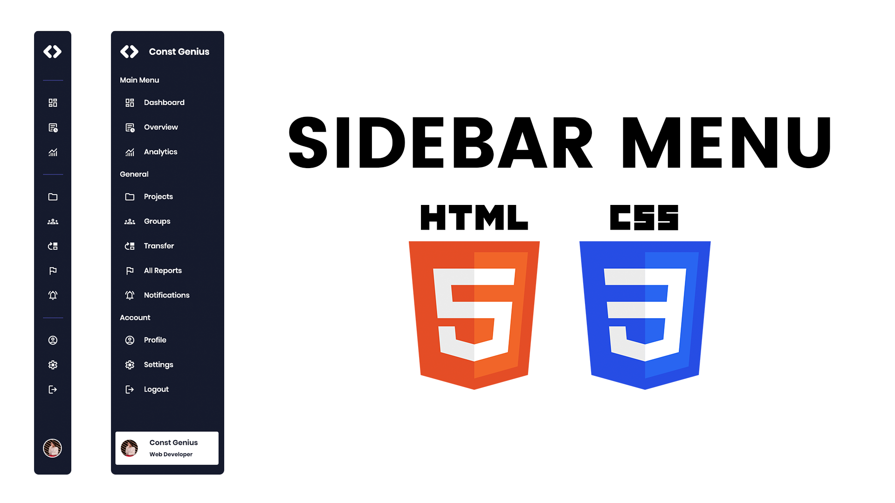

# Sidebar Menu in HTML CSS | Side Navigation Bar | Side Navbar

The Sidebar Menu tutorial demonstrates how to create a side navigation bar using HTML and CSS. This project focuses on building a sleek and functional sidebar that provides easy navigation within a website.

By using HTML for the structural elements and CSS for styling, you will learn to design a sidebar menu that can be customized to fit various web design needs. Key CSS techniques such as flexbox, positioning, and transitions are employed to create a responsive and visually appealing side navbar.

This tutorial is ideal for beginners and intermediate developers who want to enhance their web design skills by implementing a practical and stylish navigation solution for their websites.

